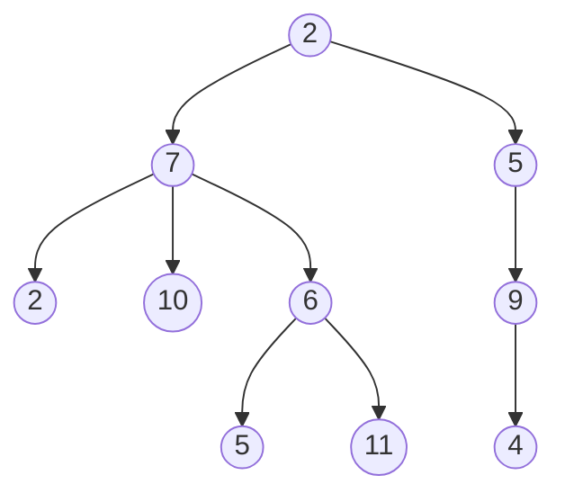

---
hide:
  - navigation
  - toc
---

# Example Notes

Abbr: The HTML specification is maintained by the W3C.

Annotation:
I am happy, damn bro(1).
{ .annotate }

1.  U.S BOY (1) 
{ .annotate}

    1.  Damn bro another annotation!

*[HTML]: Hyper Text Markup Language
*[W3C]: World Wide Web Consortium

<div class="annotate" markdown>

> Lorem ipsum dolor sit amet, (1) consectetur adipiscing elit.

</div>

1.  :man_raising_hand: I'm an annotation!

[Hover me](https://example.com "I'm a tooltip!")

- [x] Lorem ipsum dolor sit amet, consectetur adipiscing elit
- [ ] Vestibulum convallis sit amet nisi a tincidunt
    * [x] In hac habitasse platea dictumst
    * [x] In scelerisque nibh non dolor mollis congue sed et metus
    * [ ] Praesent sed risus massa
- [ ] Aenean pretium efficitur erat, donec pharetra, ligula non scelerisque

`Lorem ipsum dolor sit amet`

:   Sed sagittis eleifend rutrum. Donec vitae suscipit est. Nullam tempus
    tellus non sem sollicitudin, quis rutrum leo facilisis.

`Cras arcu libero`

:   Aliquam metus eros, pretium sed nulla venenatis, faucibus auctor ex. Proin
    ut eros sed sapien ullamcorper consequat. Nunc ligula ante.

    Duis mollis est eget nibh volutpat, fermentum aliquet dui mollis.
    Nam vulputate tincidunt fringilla.
    Nullam dignissim ultrices urna non auctor.

| Method      | Description                          |
| :---------- | :----------------------------------- |
| `GET`       | :material-check:     Fetch resource  |
| `PUT`       | :material-check-all: Update resource |
| `DELETE`    | :material-close:     Delete resource |



Lorem ipsum[^1] dolor sit amet, consectetur adipiscing elit.[^2]
[^1]: Lorem ipsum dolor sit amet, consectetur adipiscing elit.
[^2]:
    Lorem ipsum dolor sit amet, consectetur adipiscing elit. Nulla et euismod
    nulla. Curabitur feugiat, tortor non consequat finibus, justo purus auctor
    massa, nec semper lorem quam in massa.

``` cpp title="test.cpp" linenums="1"
#include<bits/stdc++.h>
```

!!! def inline end "[Subscribe to our newsletter](https://tsljgj.github.io){ .md-button }" 
    
    Lorem ipsum dolor sit amet, consectetur

!!! info inline "Lorem ipsum"

    Lorem ipsum dolor sit amet, consectetur
    adipiscing elit. Nulla et euismod nulla.
    Curabitur feugiat, tortor non consequat
    finibus, justo purus auctor massa, nec
    semper lorem quam in massa.

!!! summary inline end "Lorem ipsum"

    Lorem ipsum dolor sit amet, consectetur

!!! note annotate "Phasellus posuere in sem ut cursus (1)"

    Lorem ipsum dolor sit amet, (2) consectetur adipiscing elit. Nulla et
    euismod nulla. Curabitur feugiat, tortor non consequat finibus, justo
    purus auctor massa, nec semper lorem quam in massa.

1.  :man_raising_hand: I'm an annotation!
2.  :woman_raising_hand: I'm an annotation as well!
!!! note ""

    No title admonition.
??? note "collapsible good my friend" 

    Lorem ipsum dolor sit amet, consectetur adipiscing elit. Nulla et euismod
    nulla. Curabitur feugiat, tortor non consequat finibus, justo purus auctor
    massa, nec semper lorem quam in massa.
???+ note "Exercise [Luogu 1101](https://tsljgj.github.io){ .md-button .md-button--primary}" 

    Lorem ipsum dolor sit amet, consectetur adipiscing elit. Nulla et euismod
    nulla. Curabitur feugiat, tortor non consequat finibus, justo purus auctor
    massa, nec semper lorem quam in massa.
=== "Tab 1"

    Lorem ipsum dolor sit amet, (1) consectetur adipiscing elit.
    { .annotate }

    1.  :man_raising_hand: I'm an annotation!

=== "Tab 2"

    Phasellus posuere in sem ut cursus (1)
    { .annotate }

    1.  :woman_raising_hand: I'm an annotation as well!
!!! example "This is an example"

    === "Unordered List"

        ``` markdown
        * Sed sagittis eleifend rutrum
        * Donec vitae suscipit est
        * Nulla tempor lobortis orci
        ```

    === "Ordered List"

        ``` markdown
        1. Sed sagittis eleifend rutrum
        2. Donec vitae suscipit est
        3. Nulla tempor lobortis orci
        ``` 

<figure markdown="span">
  { width="300" }
  <figcaption>Image caption</figcaption>
</figure> 